# client-project

[Full Tutorial on using the "Client-Project App"](https://www.youtube.com/channel/UCuKlAHcp9w5KJ9IxVg3Vm8g/channels)
<!-- Add Badges -->


<!-- Add Pictures -->
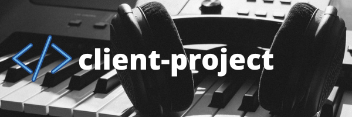
<!-- Table of Contents -->
- [client-project](#client-project)
  - [description](#description)
  - [usage](#usage)
  - [installation](#installation)
    - [initial structure](#initial-structure)
      - [Initial Folders](#initial-folders)
      - [Initial Files](#initial-files)
    - [before mixing completed](#before-mixing-completed)
    - [after mixing completed](#after-mixing-completed)
  - [testing](#testing)
  - [development/contributing](#developmentcontributing)
  - [history](#history)
  - [credits](#credits)
  - [licence](#licence)

## description

## usage

To Run the App from terminal, run this code.  Follow the Terminal Menu's instructions.

```bash
python3 new_client_project.py
```

- audio project

  To Produce a Beat, follow the Terminal Menu's instructions.
  - produce
    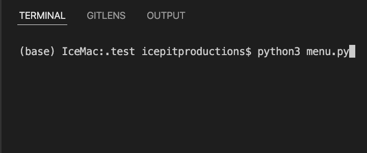
    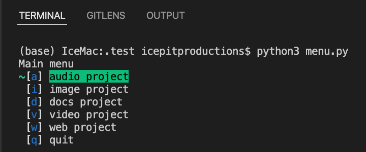
    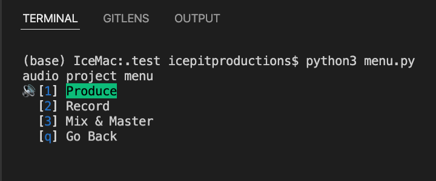
    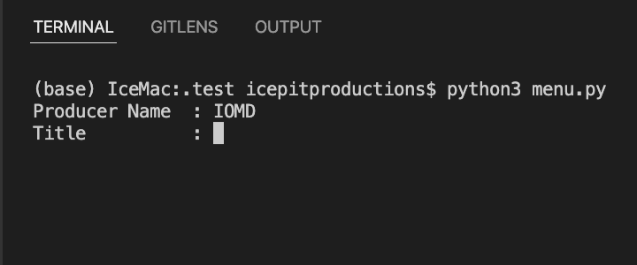
    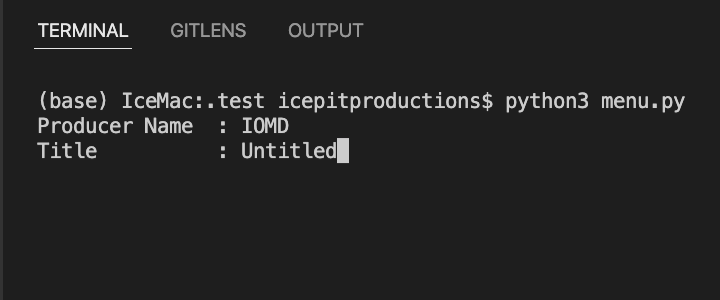
    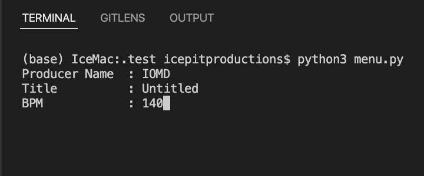
    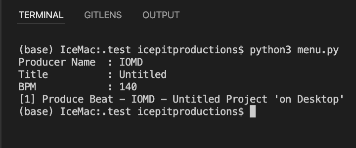
  - record
    
    
    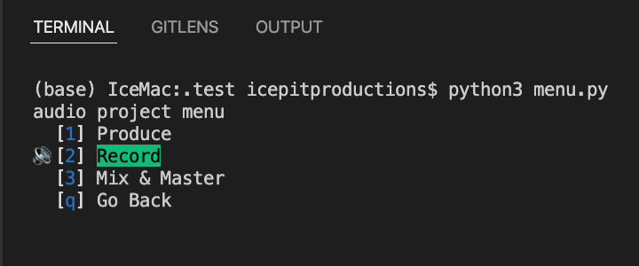
    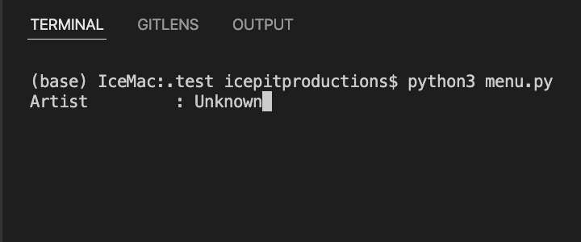
    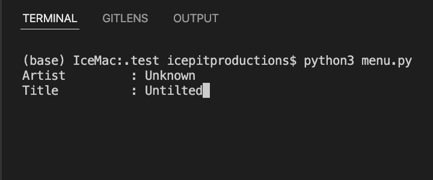
    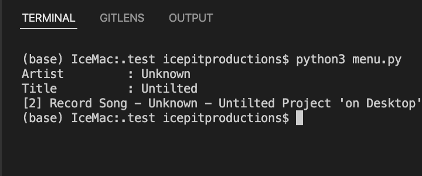
  - mix & master
    
    
    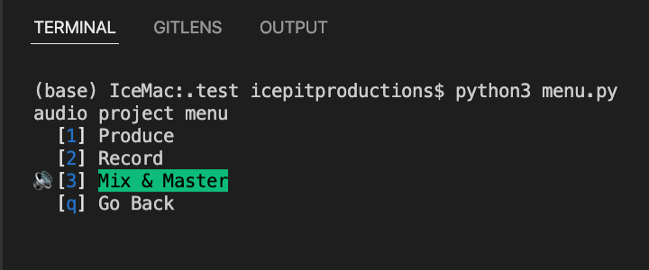
- docs project
- image project
- video project
- web project

## installation

### initial structure

#### Initial Folders

#### Initial Files

### before mixing completed

- Send these files to client:
  - `client_notes.txt`
- Received files from client
  - `client_notes.txt`

### after mixing completed

- Update these files
  - `client_notes.txt`
  - `changelog.log`
  - `README.md`
- Convert these files
  - `final_version.pdf` from `README.md`
- Send final files to clients emails
  - `final_version.mp3`
  - `final_version.pdf`
- Prepare Stems
  - Location:
    - `src/audio/stems`
  - Stems: Gang of Four
    - Stem #1. **TV** (that’s instrumental plus chorus or background vocals).
    - Stem #2. **Lead Vocal(s)** (plus its reverb of course ---basically muting everything else).
    - Stem #3. **Full Mix** (that’s what I will use unless there is a problem, and it's also a reference to prove that #1 and #2 were made correctly).
    - Stem #4. **Instrumental** (by adding this to #1 we can reduce the chorus level. By subtracting this from #1 we can increase the chorus level. By subtracting this from #3 we can increase lead and chorus. And so on! - Bob Katz
  - Stems: Archive
    - Create `stems_gang_of_four.zip` in `src/audio/stems`
    - Copy `stems_gang_of_four.zip` in `Client Library`

## testing

## development/contributing

## history

## credits

## licence
